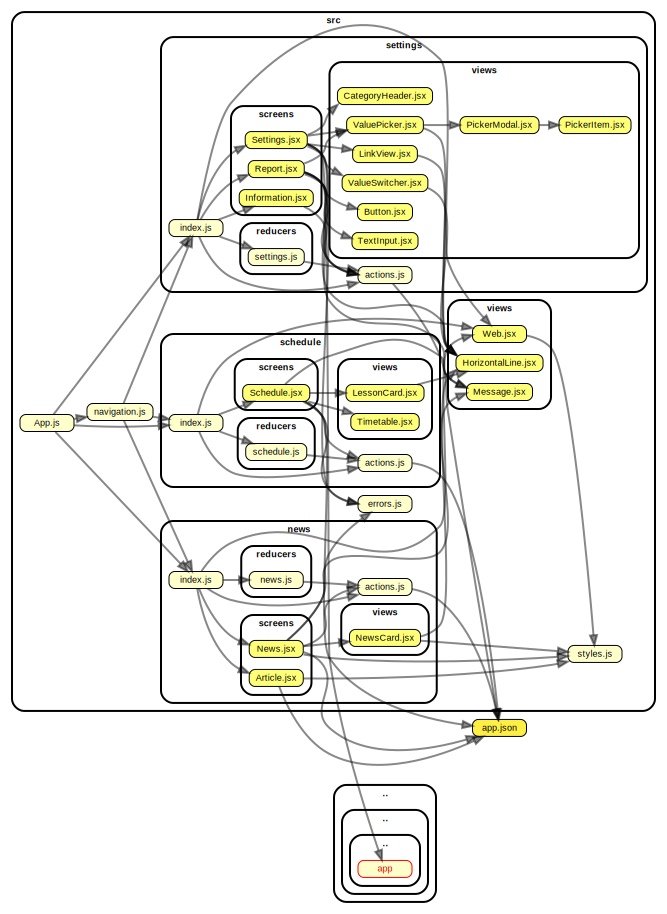

# Struktura projekta scng-mobile

```
├── src
│   ├── news
│   │   ├── reducers
│   │   ├── screens
│   │   ├── views
│   │   ├── actions.js
│   │   └── index.js
│   ├── schedule
│   │   ├── reducers
│   │   ├── screens
│   │   ├── views
│   │   ├── actions.js
│   │   └── index.js
│   ├── settings
│   │   ├── reducers
│   │   ├── screens
│   │   ├── views
│   │   ├── actions.js
│   │   └── index.js
│   ├── views
│   ├── styles.js
│   ├── navigation.js
│   ├── errors.js
│   └── App.js
├── node_modules
├── ormconfig.js
├── schools.json
├── package.json
├── index.js
├── README.md
└── .gitignore
```


