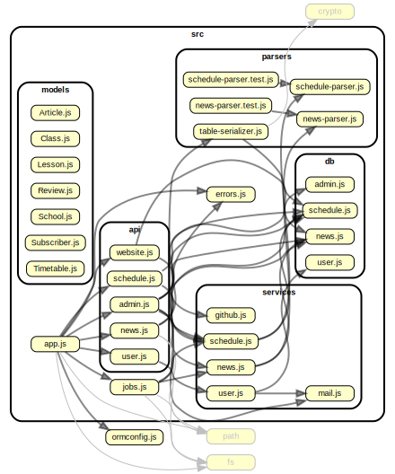

# Struktura projekta scng-api

```
├── src
│   ├── api
│   ├── db
│   ├── models
│   ├── parsers
│   ├── services
│   ├── views
│   ├── jobs.js
│   └── app.js
├── node_modules
├── ormconfig.js
├── schools.json
├── package.json
├── README.md
└── .gitignore
```


